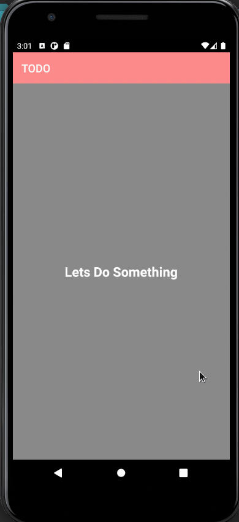
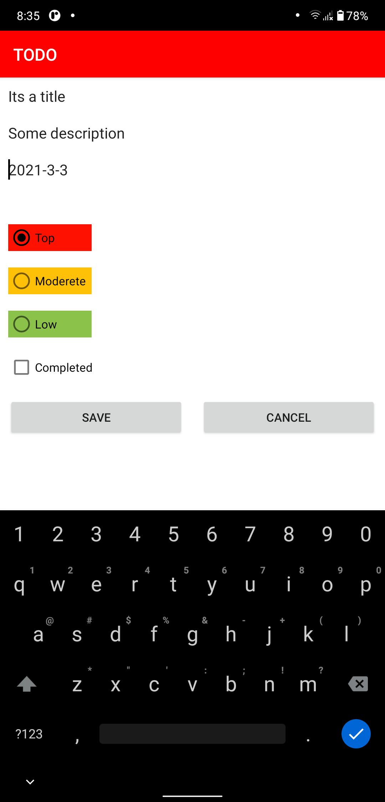
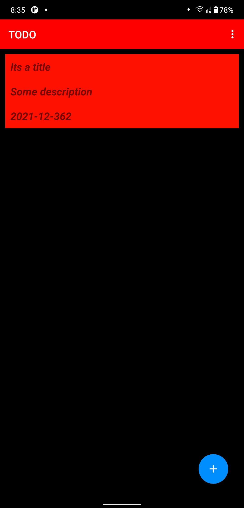
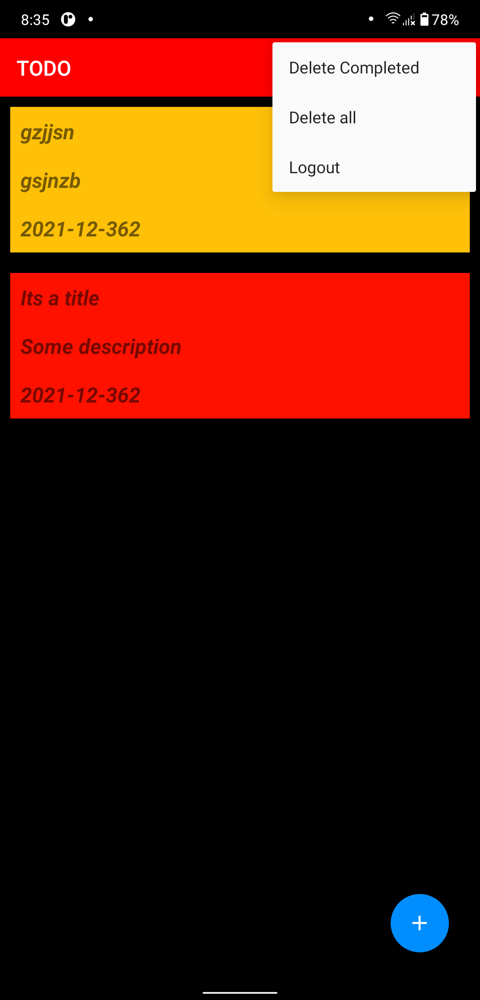

# TODO Android App
## This project is build for British College Assigement

This is a simple todo app withch can handle following things offline using sqlite.
## Features
- Local Authentication
- Can save multiple todo task
- Can set task priority as Top, Moderete and Low
- Can set task to complete
- Can delete multiple completed task or all taskes
- Can logout

## Full Application Demo

## Screenshots

## Reference
[Binay Shah](https://github.com/binay-shah/android-todo/)
[EBBI](https://github.com/ebbi/TodoMVVM)
[Stackoverflow](https://stackoverflow.com/)
[Youtube](https://youtube.com/)